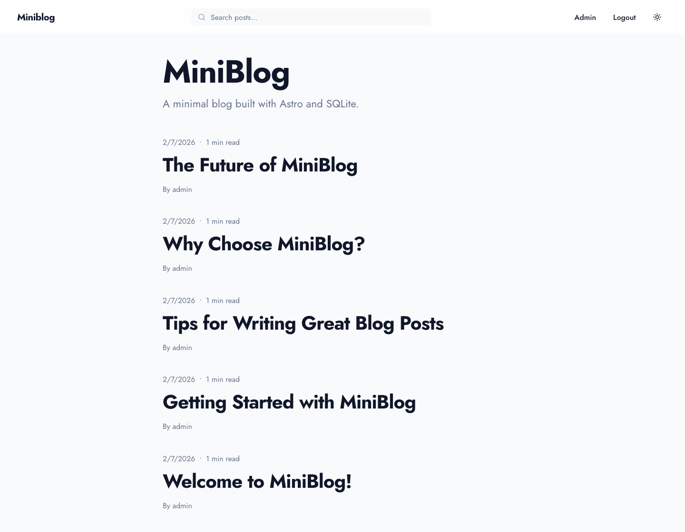
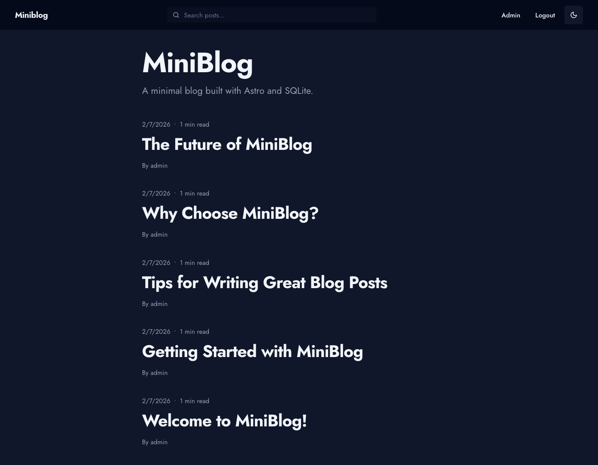
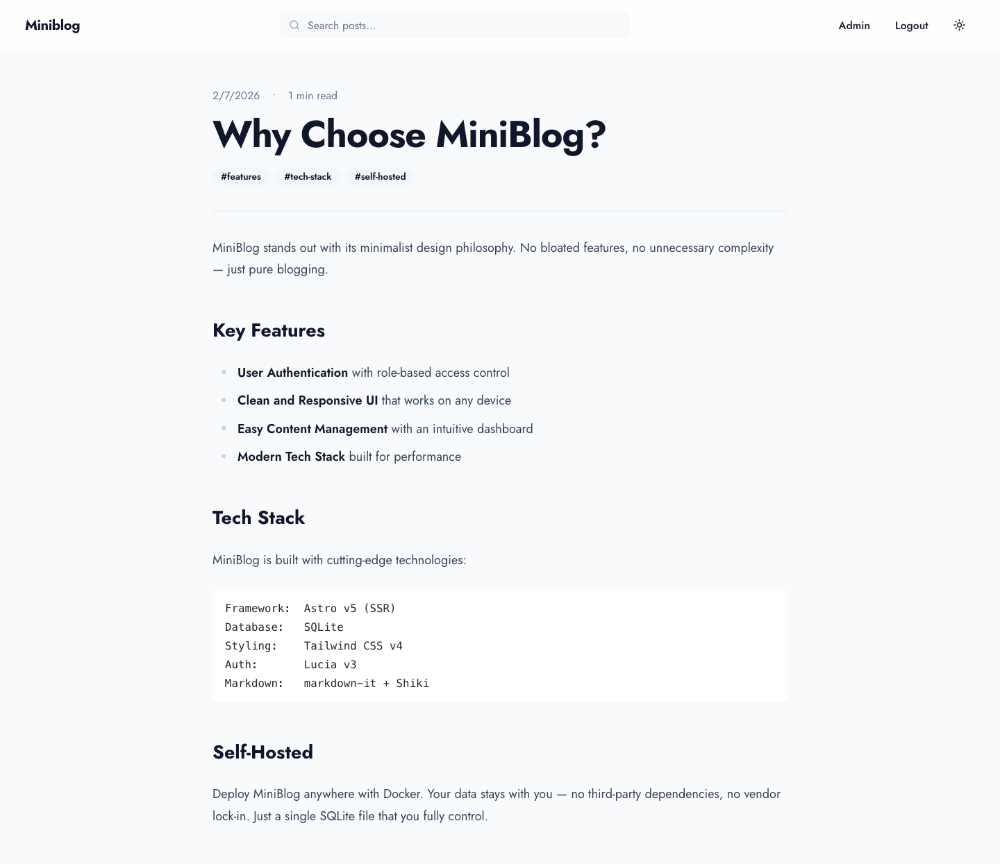
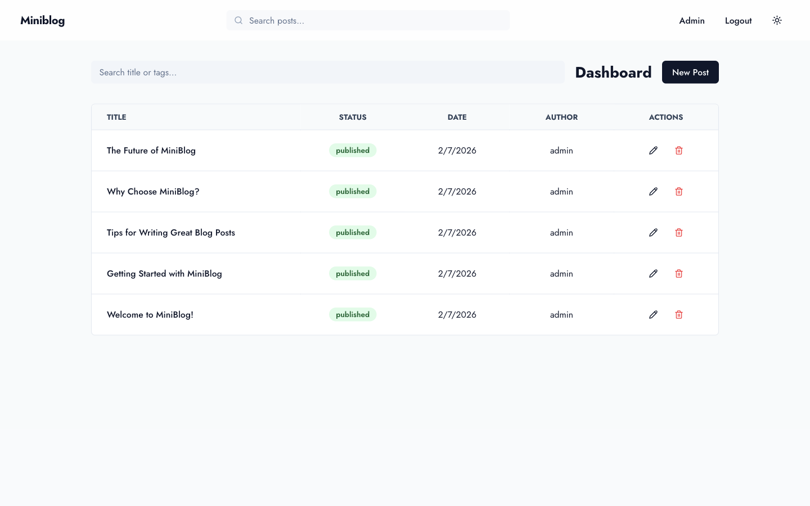
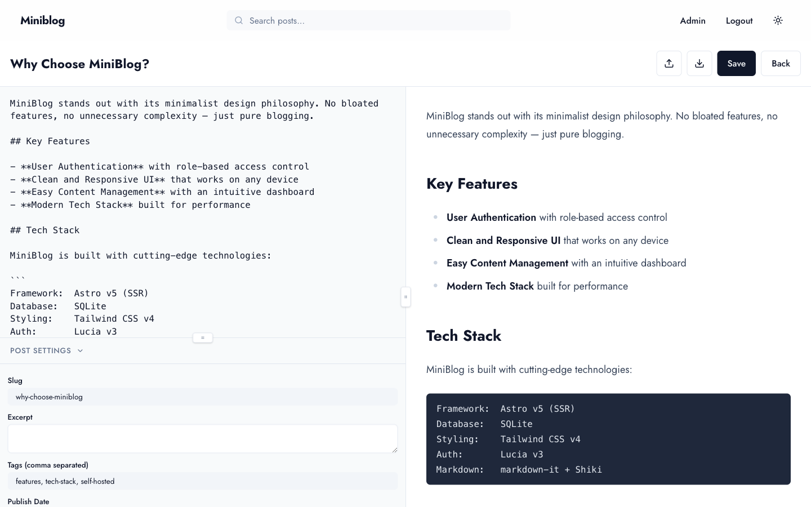
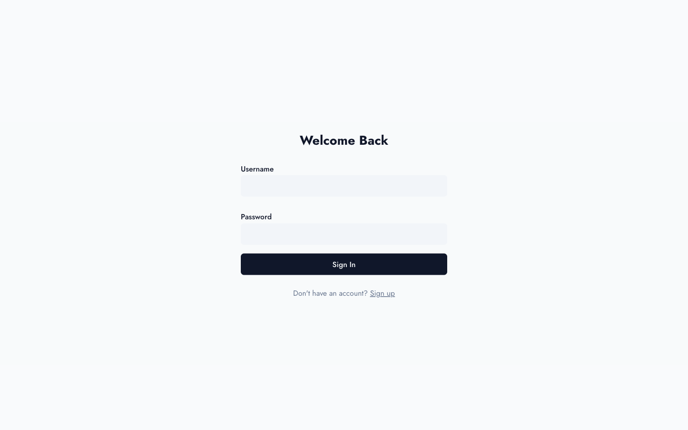

# Miniblog

A self-hosted, minimal blog platform with an advanced markdown editor, role-based access control, and dynamic OG image generation. Built with Astro SSR + SQLite.



## Features

- **Pure Astro SSR** with Node standalone adapter
- **Bun** runtime and package manager
- **Drizzle ORM** + **SQLite** via libsql
- **Lucia Auth v3** with cookie-based sessions and Bcrypt
- **Tailwind CSS v4** with CSS-first configuration
- **Split-pane Markdown Editor** with live preview
- **Role-Based Access Control** (Owner, Admin, User)
- **Open Graph** image generation per post
- **Dark/Light Mode** with system preference support
- **View Transitions** for smooth navigation
- **Responsive Design** for all devices
- **Sitemap** auto-generation
- **Docker** ready for self-hosting

## Screenshots

### Homepage

The clean, minimal homepage lists all published posts with reading time estimates and author attribution.

|                  Light Mode                   |               Dark Mode                |
| :-------------------------------------------: | :------------------------------------: |
|  |  |

### Blog Post

Posts are rendered with full markdown support including headings, bold text, lists, code blocks, blockquotes, and tag badges.



### Admin Dashboard

The dashboard provides a complete overview of all posts with status badges, filtering, sorting, and quick actions for editing and deleting.



### Markdown Editor

The split-pane editor features live markdown preview, import/export support, post settings (slug, excerpt, tags, publish date, status), and a resizable layout.



### Login

Simple, clean authentication with username and password. Supports registration for new users.



## Getting Started

### Prerequisites

- [Bun](https://bun.sh) installed
- Docker (optional, for containerized deployment)

### Environment Setup

Create a `.env` file:

```env
DB_FILENAME=miniblog.db
OWNER_CREDENTIALS=admin:$2y$10$...
HOST=0.0.0.0
PORT=4321
NODE_ENV=production
```

Generate the `OWNER_CREDENTIALS` hash with `htpasswd`:

```bash
htpasswd -nbB -C 10 username password
```

### Installation

```bash
bun install
```

### Database Setup

```bash
bun run db:push
```

### Development

```bash
bun run dev
```

### Build & Run

```bash
bun run build
bun dist/server/entry.mjs
```

### Testing

Tests run using a separate dev database.

```bash
bun run test      # Unit tests (Vitest)
bun run test:e2e  # E2E tests (Playwright)
bun run test:all  # Run both
```

## Docker

```bash
docker compose up --build
```

Or pull from the registry:

```bash
docker pull ghcr.io/hekpyto/miniblog
```

## Tech Stack

| Layer     | Technology                                           |
| --------- | ---------------------------------------------------- |
| Framework | Astro v5 (SSR)                                       |
| Styling   | Tailwind CSS v4 + @tailwindcss/typography            |
| Database  | SQLite via @libsql/client                            |
| ORM       | Drizzle ORM                                          |
| Auth      | Lucia v3 + oslo (Bcrypt)                             |
| Markdown  | markdown-it + Shiki (dual-theme syntax highlighting) |
| OG Images | Satori + Sharp                                       |
| Runtime   | Bun                                                  |
| Testing   | Vitest + Playwright                                  |
| CI/CD     | GitHub Actions                                       |

## RBAC

| Role      | Access                                |
| --------- | ------------------------------------- |
| **Owner** | Full access including user management |
| **Admin** | Dashboard and editor                  |
| **User**  | Public pages only                     |
